# ZK-4KX Enhanced Power Supply — temperature-controlled fan

A bench power supply built around the cheap **ZK-4KX buck-boost panel module** (IN 5–30 V, OUT 0.5–30 V,
[datasheet](https://www.laskakit.cz/user/related_files/zk-4kx_english.pdf)), with a 3D-printed case and a small
add-on board that runs a cooling fan **only when the module gets warm**, faster as it gets hotter.
Everything runs from the same DC input (9 V / 2 A adapter tested, up to ~28 V supported).

| Finished supply | Inside |
|---|---|
| 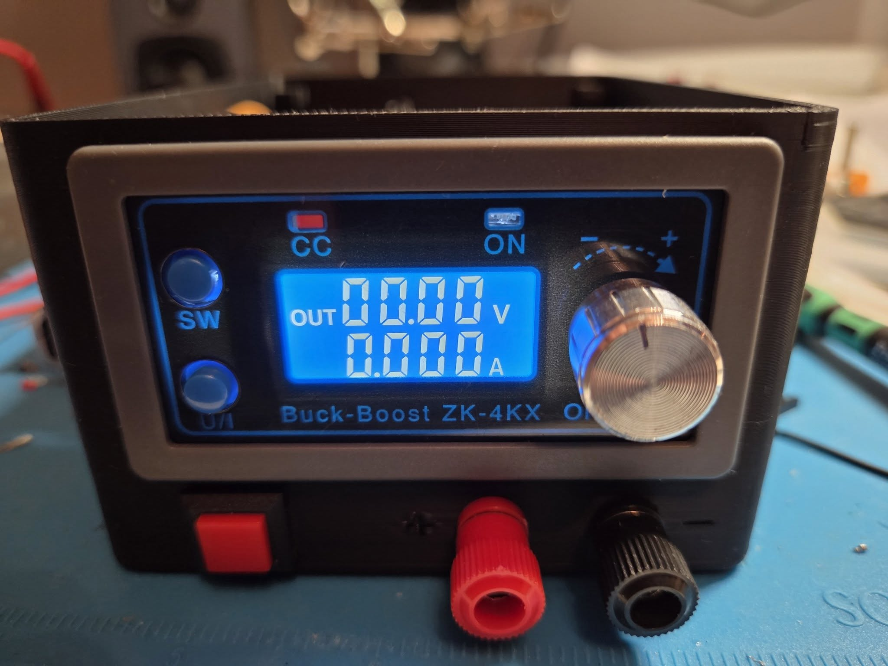 | 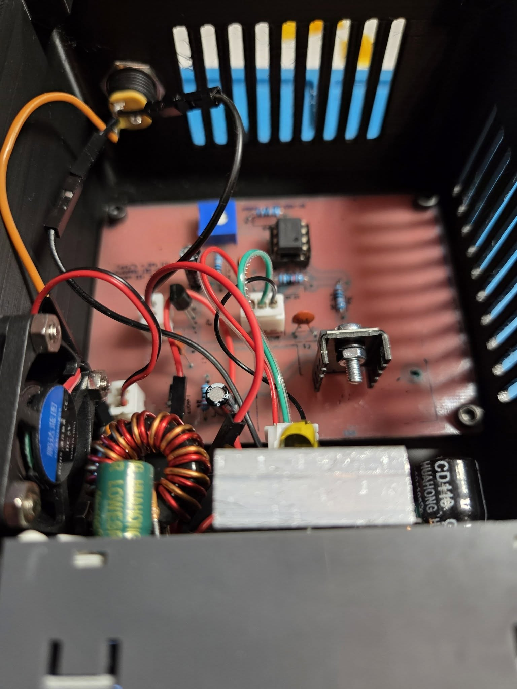 |

- Single-sided PCB, 90 × 66 mm, designed for **home etching** (toner transfer, no vias, no jumpers) — Gerbers included if you'd rather order it.
- Through-hole parts only: LM35, LM358, LM317, 78L05, one trimmer.
- Fan **off** below a start temperature you set with the trimmer (~15 … 52 °C), full speed ~18 °C above it.
- Fan voltage can never exceed 5 V, whatever the input voltage or faults.
- Printable case, 98 × 128 × 68 mm, magnetic lid, no supports.

**Build guide:** [instruction.md](instruction.md) — parts, etching, assembly, wiring, first power-up, calibration, troubleshooting.

## Downloads

| What | File |
|---|---|
| Bill of materials | [bom.md](bom.md) |
| Schematic | [KiCAD/SursaTensiune_sch.pdf](KiCAD/SursaTensiune_sch.pdf) |
| PCB print for toner transfer (+ solder mask film), A4, print at 100 % | [KiCAD/toner_B.Cu_1to1.pdf](KiCAD/toner_B.Cu_1to1.pdf) |
| Gerbers + drill files for ordering the PCB | [KiCAD/gerber/SursaTensiune_gerbers.zip](KiCAD/gerber/SursaTensiune_gerbers.zip) |
| Assembly BOM in PCBWay's format | [KiCAD/SursaTensiune_BOM_PCBWay.xlsx](KiCAD/SursaTensiune_BOM_PCBWay.xlsx) |
| Enclosure, printable | [Enclosure_base.3mf](mechanical/enclosure/Enclosure_base.3mf), [Enclosure_cover.3mf](mechanical/enclosure/Enclosure_cover.3mf) (print orientation; STL and STEP next to them), [Bambu Studio project for the A1](mechanical/enclosure/Enclosure_A1_project.3mf) — see [enclosure notes](mechanical/enclosure/README.md) |
| Solder-mask jig, printable (optional) | [Mask_jig.stl](mechanical/mask_jig/Mask_jig.stl) — see [jig notes](mechanical/mask_jig/README.md) |
| KiCad 10 project | [KiCAD/](KiCAD/) — see [PCB_info.md](KiCAD/PCB_info.md) |

## Build photos

| Design | | |
|---|---|---|
| 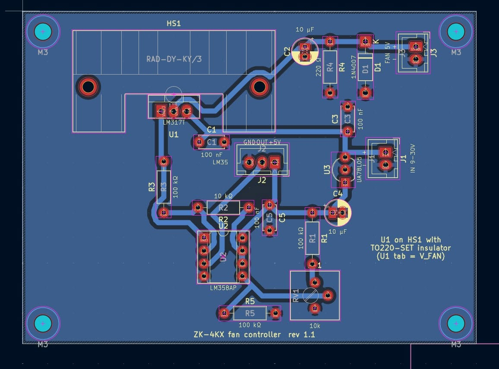 | 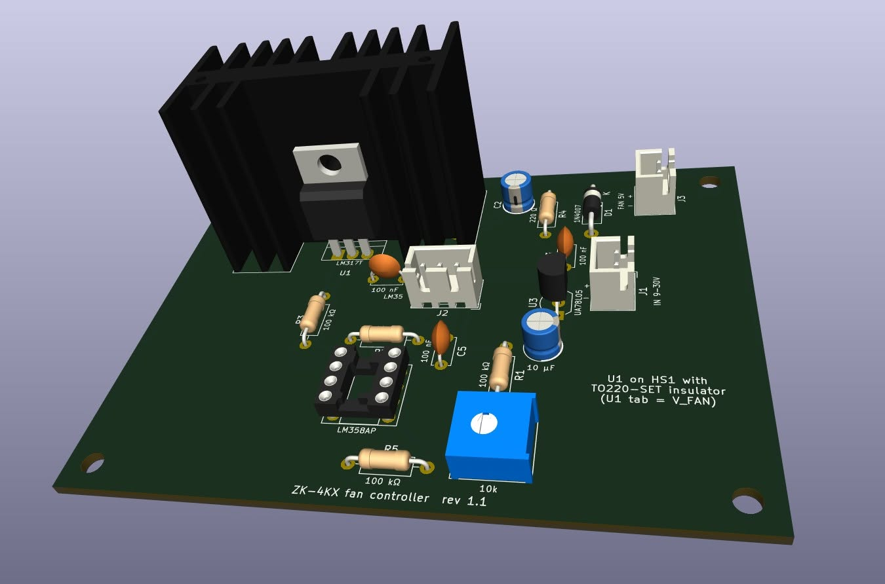 | 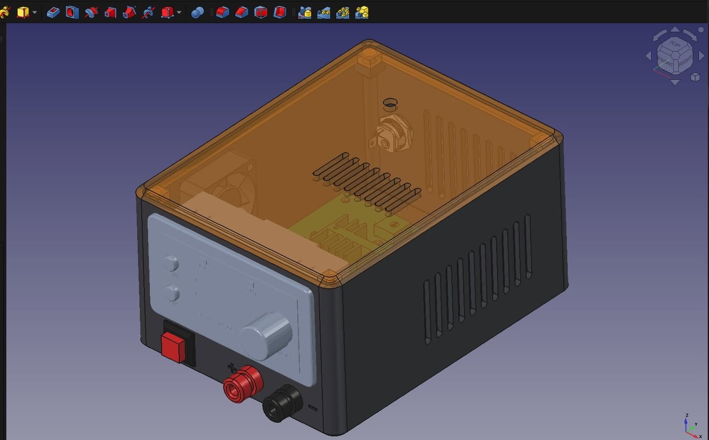 |
| PCB layout (KiCad) | 3D view | Enclosure (FreeCAD) |

| Making the board | | |
|---|---|---|
| 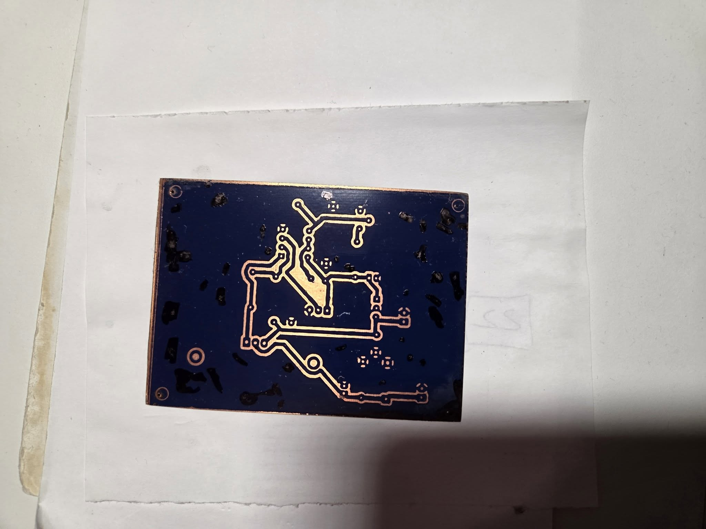 | 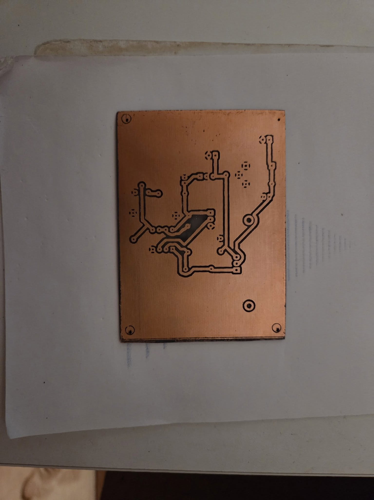 | 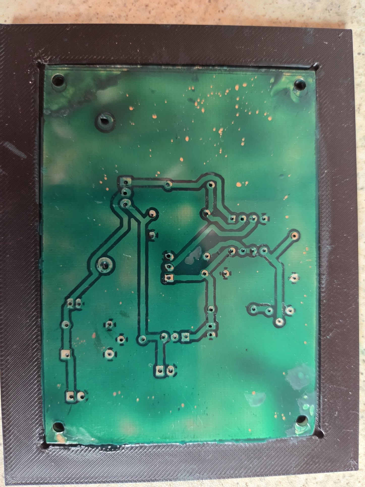 |
| Toner transferred | Etched | UV solder mask, board in the printed jig |
| 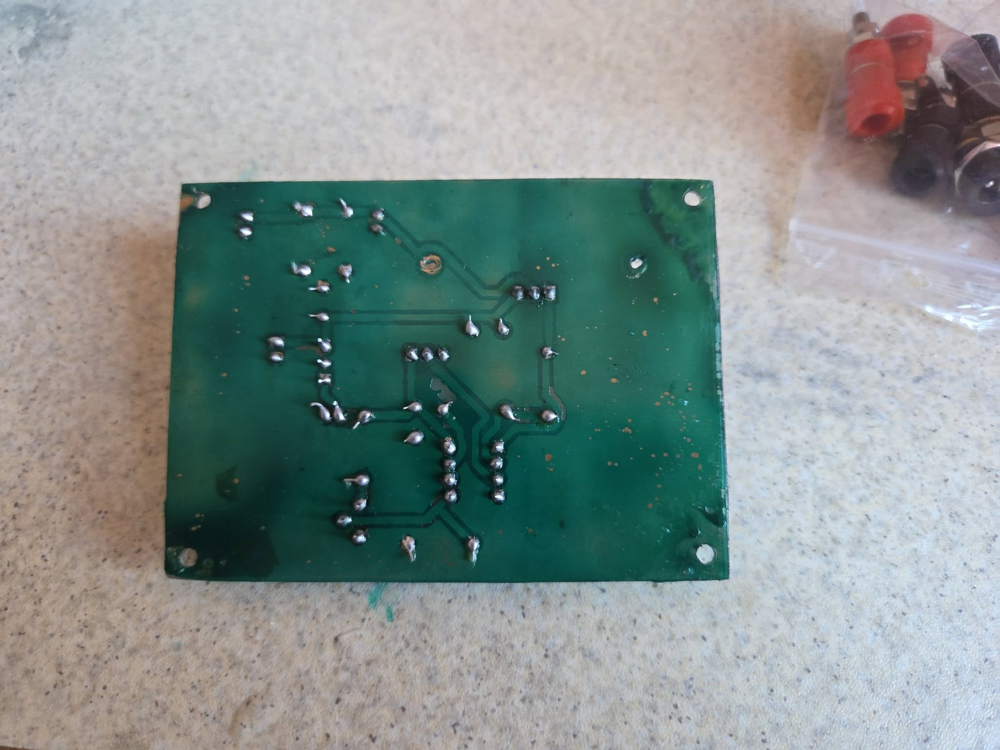 | 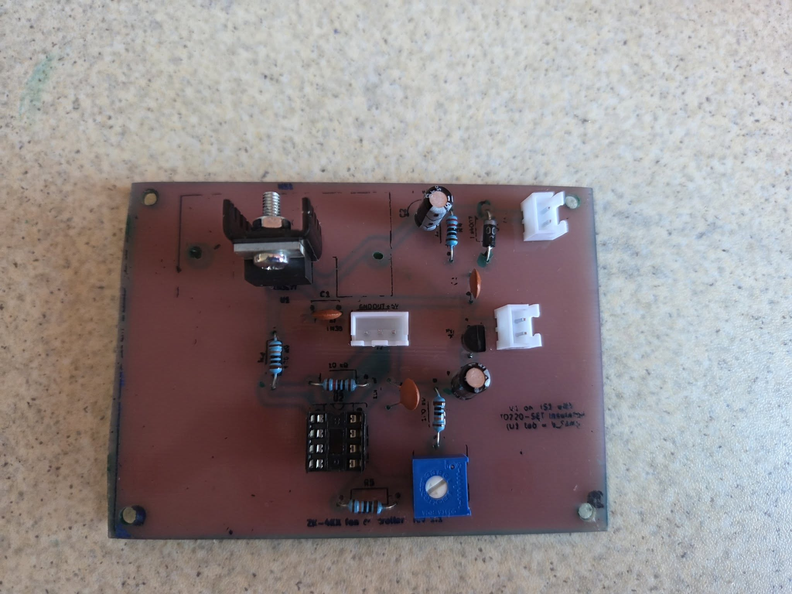 | 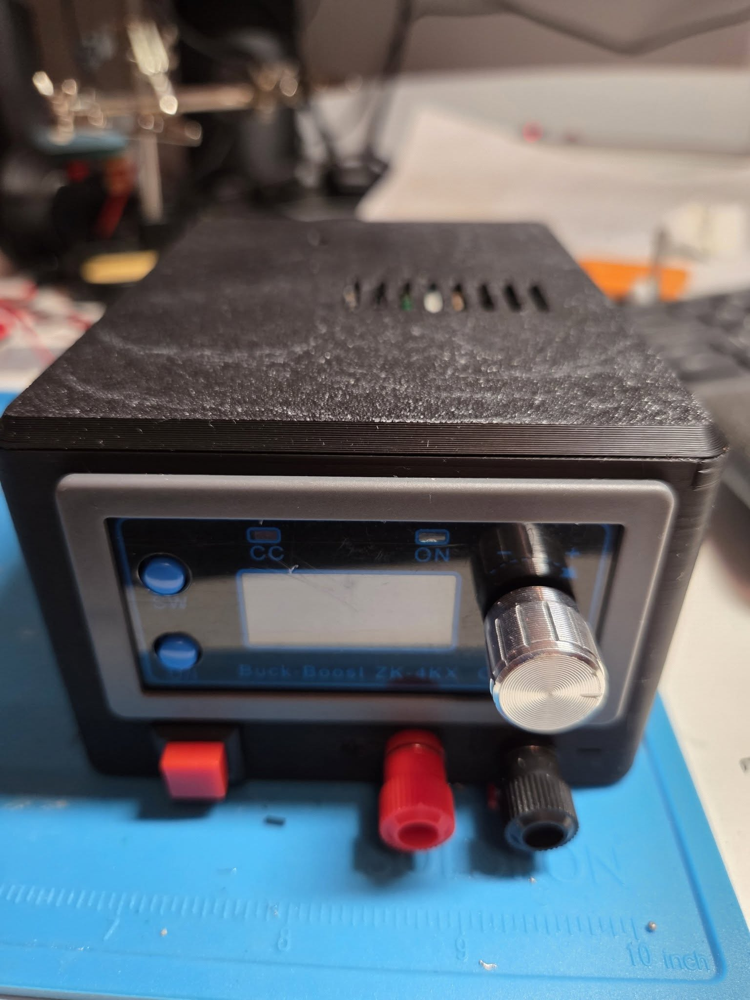 |
| Soldered (bottom) | Assembled board | Closed case, vents on top |

## How it works

| Block | Parts | Function |
|---|---|---|
| 5 V aux | U3 78L05, C3, C4, C5 | Supplies U2 and the LM35 |
| Start temperature | R1, RV1, R5, U2B | V_REF = 0 … 0.42 V, buffered |
| Amplifier | U4 LM35, U2A, R2, R3 | V_ADJ = 11·V_LM35 − 10·V_REF (clamped 0 … ~3.5 V by the 5 V supply) |
| Fan supply | U1 LM317, C1, C2, R4, D1 | V_FAN = V_ADJ + 1.25 V → 1.25 V (off) … 4.75 V (full) |

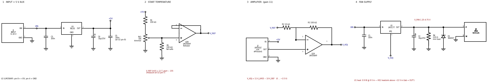

- Fan: Raspberry Pi type 30×30×10 mm, 5 V / 0.2 A, 2-wire. The LM35 sits on the ZK-4KX heatsink.
- Fan starts (≈ 2.8 V, measured) at **T_start**, reaches full speed at **T_start + ~18 °C**.
- T_start range with RV1: **~15 … 52 °C**.
- **Calibration:** measure U2 pin 7 → **V_REF [mV] = 11 · T_start − 155** (e.g. 285 mV → 40 °C).
- Narrower ramp (~9.5 °C): R2 = 5.1 kΩ.
- Fail-safes: pot wiper open → fan runs from ~17 °C (R5); LM35 disconnected → fan full speed.
- U1 dissipation: 0.9 W @ 9 V in, 5.3 W @ 30 V in (HS1 + insulating kit; tab = OUT).
- Simulated in both ngspice and LTspice (nominal, trimmer extremes, input sweep, power-up, open wiper/sensor,
  op-amp offset worst cases) — see [simulation/README.md](simulation/README.md).

## Repository layout

| Path | Content |
|---|---|
| `bom.py` → `bom.md` | BOM, single source of truth. Run `python bom.py`. |
| `instruction.md` | Build guide |
| `schematic/` | Schematic image (schemdraw, `gen_schematic.py`), labels from `bom.py` |
| `KiCAD/` | KiCad 10 project, generator scripts (`gen/`), print PDF, Gerbers. See `KiCAD/PCB_info.md`. |
| `simulation/` | Same scenarios in ngspice 46 and LTspice 26 |
| `mechanical/` | Enclosure and solder-mask jig (FreeCAD scripts, STEP, STL, 3MF), part models used for fit checks. See `mechanical/README.md`. |
| `photos/` | Build photos |

## Credits and third-party files

These files are not mine and keep their original terms (they are **not** covered by this project's licenses):

- `mechanical/stl/ZK-4KX Buck Boost Converter.STL` — by Legacy_Micro,
  [Printables 401707](https://www.printables.com/model/401707-basic-model-zk-4kx-buck-boost-converter), CC0.
- `mechanical/button/DS-431_square_push_button_red.step` — from
  [GrabCAD](https://grabcad.com/cads/files/da40e36f2500ba5d71d7cf6f930e5d73/original.step).
- `mechanical/fan/Fan_30x30x10_5V_2pin.step` — modified from A. Kirchner's 30×30×8 fan model,
  [GrabCAD](https://grabcad.com/library/fan-30x30x8mm-5v-2-pin-1).
- `mechanical/dc_jack/DC_jack_5.5x2.1_panel_10A.step` (+ 2 renders) — from
  [GrabCAD](https://grabcad.com/library/power-jack-socket-5-5-x-2-1-mm-10a-dc-1).
- `mechanical/heatsink/*.jpg` — TME product images of the Stonecold RAD-DY-KY heatsink.
- ZK-4KX datasheet and heatsink datasheet are linked, not included.

**Not included** (licences don't allow redistribution) — download them and save under these names if you need them:

| File | What | Where to get it | Needed for |
|---|---|---|---|
| `KiCAD/vendor/3386P-1-103LF.stp` | Bourns 3386P trimmer 3D model | [SamacSys / Component Search Engine](https://componentsearchengine.com) | RV1 3D body in KiCad |
| `mechanical/trimmer/3386P-1-103LF.stp` | same model (copy) | as above | reference only |
| `mechanical/banana/930176100.stp` | Hirschmann 930176100 banana socket | [SamacSys / Component Search Engine](https://componentsearchengine.com) | `mechanical/enclosure/assembly.py` |
| `simulation/vendor/onsemi_LM358.mod` | onsemi LM358 SPICE model | [onsemi models](https://onsemi.com/support/design-resources/models?rpn=LM358) | `run_sim.py --vendor` |
| `simulation/vendor/LT317A.sub` | ADI LT317A SPICE model | bundled with LTspice (`lib.zip` → `lib/sub/LT317A.sub`) | `run_sim.py --vendor` |

Everything else (schematic, PCB, Gerbers, enclosure, behavioral simulations) works without them.

## License

Copyright © 2026 Catalin Serafimescu. See [LICENSE](LICENSE):

- Hardware (KiCad project, Gerbers, enclosure and jig) — [CERN-OHL-S-2.0](LICENSES/CERN-OHL-S-2.0.txt)
- Software (Python scripts, SPICE files) — [MIT](LICENSES/MIT.txt)
- Documentation and images — [CC BY-SA 4.0](LICENSES/CC-BY-SA-4.0.txt)

Mains is not involved, but you are working with up to 30 V / 4 A — build and use at your own risk.
